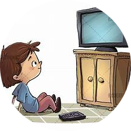
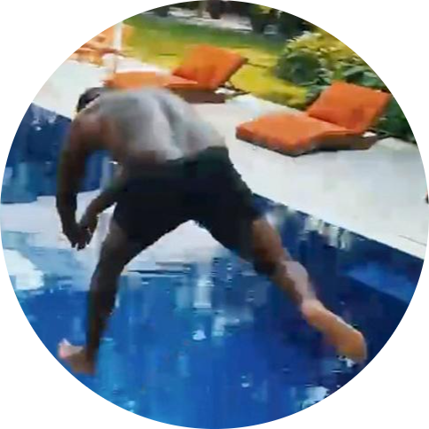

<!DOCTYPE html>
<html lang="en">
<head>
    <meta charset="UTF-8">
    <meta http-equiv="X-UA-Compatible" content="IE=edge">
    <meta name="viewport" content="width=device-width, initial-scale=1.0">
    <link rel="icon" href="image/mountain.png">
    <link rel="stylesheet" href="css/style.css">
    <link rel="stylesheet" href="kulit.html">
    <link rel="preconnect" href="https://fonts.googleapis.com">
    <link rel="preconnect" href="https://fonts.gstatic.com" crossorigin>
    <link href="https://fonts.googleapis.com/css2?family=Indie+Flower&display=swap" rel="stylesheet">
    <link rel="preconnect" href="https://fonts.googleapis.com">
    <link rel="preconnect" href="https://fonts.gstatic.com" crossorigin>
    <link href="https://fonts.googleapis.com/css2?family=Indie+Flower&family=Nerko+One&display=swap" rel="stylesheet">
    
    <title>My Website </title>
</head>
<body>
    

        

        <h1> I'm Rienarose </h1>
        
 <b> A Programmer <b> 

        
        
    
    
      
    

        

            
        <h2> Hello! </h2>
        
 I'm Rienarose Durwin, 20, live in Sandiat East, San Manuel, Isabela.  A Student, Web Developer, App Developer and Programmer and Also a Lover. I Love video games and coffee. 

        

    

 

    

    <h2><b> My Skills </b></h2>
    
    

            
             <h3>Listening Music</h3>
             
 Listening Music my Stress-Reliver and Happiness. 

        

    
        

            
            <h3> <b>Watching Movies</b> </h3>
        
 Watching Movies is my pastime because it provides  entertainment, relaxation and a way to experience the different stories and emotions. 

          

    

    

        
         <h3>Dancing</h3>
         
 Dancing is my way to release energy and express myself. and enjoy it for the rhythm, ceativity, and it sense of community brings.  

    

    

        
        <h3> <b>Cooking</b> </h3>
    
 Cooking as a creative, fulfilling, and enjoyable activity that involves preparing and sharing delectable meals.  

      

    
    

        
         <h3>Swimming is my Sports</h3>
         
 I love Swimming beacause it's great way to get exercise, unwind, and renew myself. I also like the freedom it gives me in the water. 

    

    

    

        
        <h2> Get in Touch </h2>
        <h3> Kung hindi man tayo hanggang dulo'
            Wag mong kalimutan
            Nandito lang ako, laging umaalalay
            Hindi ako lalayo.
         </h3>
         <h4><b>(Kundiman lyrics)</b></h4>
        
 If you're passionate about music and wants to connect, share insights, or discuss your fav genres and artist, I'd love to hear from you. Let's explore the rhythms and melodies that inspire us! 
 -->
       <a href="notweb.html" class="button">   Contact Me!  </a>
        

       
        

            <a class="footer-link" href="notweb.html"> Facebook </a>
            <a class="footer-link" href="notweb.html"> Github </a>
            <a class="footer-link" href="notweb.html"> Twitter </a>
            <a class="footer-link" href="notweb.html"> Youtube </a>
            <a class="footer-link" href="notweb.html"> Instagram </a>
           
 ⓒ 2022 Rienarose Durwin @ Isabela State University
 
         

       
    
    

</body>
</html>
